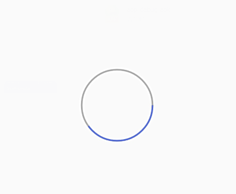

# CircleProgressBar
圆形进度条，通过setProgress方法设置进度的更新

xml视图中可采用如下方法设置

	<com.example.circleprogressbar.CircleProgressBar
        android:id="@+id/progress"
        android:layout_centerInParent="true"
        android:layout_width="80dp"
        android:layout_height="80dp"

        app:roundColor="#ffffff"
        app:circleNormalColor="#a3a3a3"
        app:circleProcessColor="#4c65d7"/>